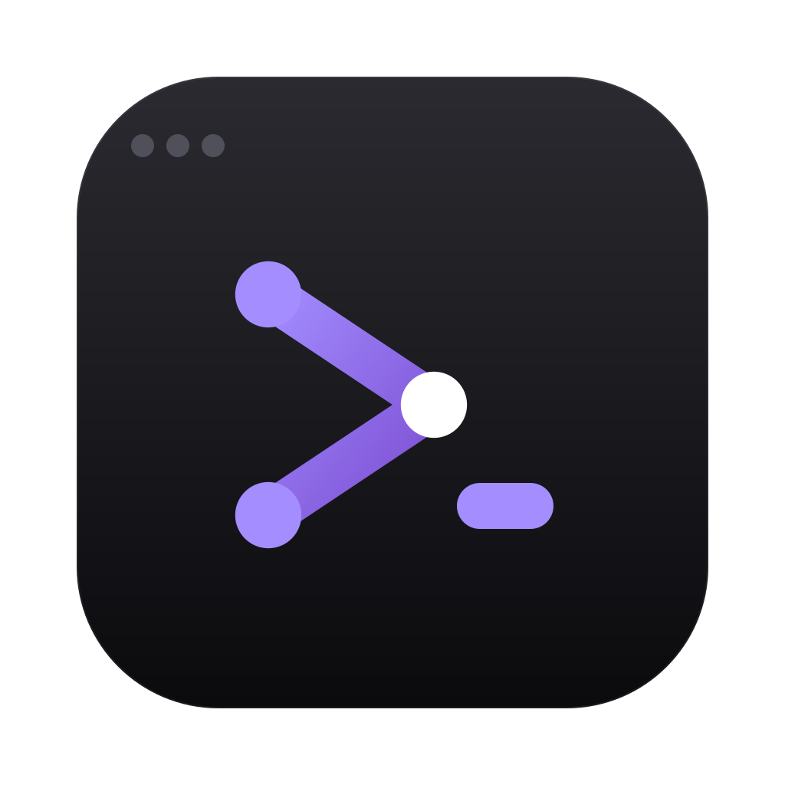
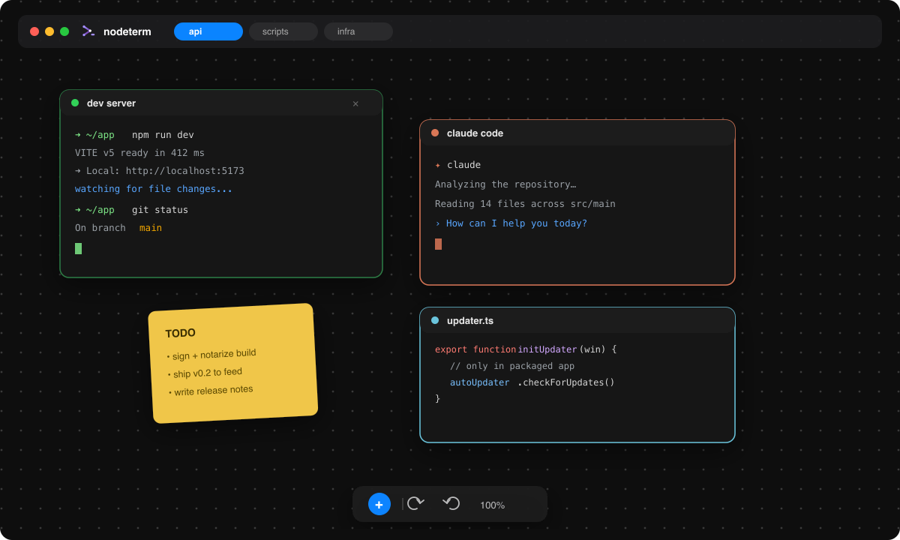

<div align="center">



# nodeterm

**A node-based terminal manager — your terminals on an infinite canvas.**

Multiple real terminals live as draggable nodes on a single pan/zoom canvas.
Built for people with ADHD and scattered workflows: a spatial layout instead of
a stack of hidden tabs.

[-black)](https://nodeterm.dev)
[](https://www.electronjs.org/)
[](./LICENSE)
[](https://github.com/eneskirca/nodeterm/stargazers)
[](https://github.com/eneskirca/nodeterm/releases)

[Download](#-download) · [Features](#-features) · [Build from source](#-build-from-source) · [Architecture](#-architecture) · [License](#-license)

</div>

---

<div align="center">
  
  <br/>
  <sub><i>Illustration of the canvas — swap in a real screenshot/GIF when ready.</i></sub>
</div>

## Why nodeterm

Stacked terminal tabs hide context — you lose track of what's running where. nodeterm
turns that into a **map**: every shell is a node you can place, group, label, and zoom
into. Sessions are spatial and persistent, so your mental model stays intact across
restarts. The architecture is built so remote access and premium tiers can slot in
later without a UI rewrite.

## ✨ Features

- **Real terminals as nodes** — each node runs its own shell (PTY) via `node-pty`; drag,
  resize, pan, and zoom freely on a React Flow canvas.
- **Session continuity (tmux)** — terminals keep running across node remounts *and* full
  app restarts, including live processes. Close a node's × to truly end its session.
- **Projects / tabs** — each project is its own canvas with its own working directory;
  switch between them without losing any running terminal.
- **Many node kinds**, all on the same canvas:
  - 🖥 **Terminal** — xterm + tmux, click-to-rename, color, tags, AI naming.
  - ✦ **Claude Code** — a terminal preset that launches `claude`.
  - 📝 **Sticky note** — free-text colored notes.
  - 🗂 **Group** — frame and move related nodes together.
  - ✏️ **Editor** — Monaco code editor for a file (⌘S to save, markdown preview).
  - 🔀 **Diff** — Monaco diff editor for staged/unstaged changes.
- **Source control** — VS Code-style file-level stage/unstage, discard, branch
  switch/create, commit, push/sync/publish, and `gh` sign-in — backed by system `git`.
- **AI commit messages & terminal names** — bring-your-own local agent CLI
  (claude / codex / custom) run read-only on the staged diff or captured output.
- **Command palette** (⌘K), **file explorer** (⌘⇧E), **markdown view** (⌘M),
  **undo/redo** (⌘Z / ⌘⇧Z), and a native macOS dark UI.
- **Auto-update & in-app announcements** — the app checks a self-hosted feed and
  surfaces a "Restart to update" banner and product news.

## 📦 Download

Grab the latest `.dmg` from **[nodeterm.dev](https://nodeterm.dev)** (Apple Silicon and
Intel builds). The app auto-updates itself from there.

> Until the build is signed & notarized, macOS Gatekeeper may warn on first launch —
> right-click the app → **Open** to bypass it once.

## 🛠 Build from source

Requires Node.js 20+ and macOS.

```bash
npm install        # deps + rebuilds node-pty against Electron's ABI (postinstall)
npm run dev        # dev mode with renderer HMR
npm run build      # production build into out/
npm start          # preview the production build
npm run typecheck  # fastest correctness gate (no test runner yet)
npm run dist       # local UNSIGNED .dmg into dist/ (smoke test)
```

`npm run dist` builds an unsigned `.dmg` for local testing.

## ⌨️ Keyboard shortcuts

| Shortcut | Action |
| --- | --- |
| `⌘K` | Command palette |
| `⌘T` / `⌘⇧C` | New terminal / New Claude Code |
| `⌘W` | Close the selected node |
| `⌘Z` / `⌘⇧Z` | Undo / Redo |
| `⌘M` | Toggle markdown view (terminal / editor) |
| `⌘⇧E` | File explorer |
| `⌘,` | Settings · `⌘/` Shortcuts |
| `Right-click` | Actions menu (empty space or node) |

## 🏗 Architecture

- **Electron, three contexts** — `src/main` (Node: PTY, fs, git), `src/preload` (the only
  bridge, `window.nodeTerminal`), `src/renderer` (React UI). `src/shared` holds the types
  and IPC channel names used by all three.
- **`TerminalTransport` abstraction** — the renderer depends only on this interface, never
  on IPC or node-pty directly. Today it's `LocalTransport`; a future `RemoteTransport`
  (WebSocket to a remote agent) implements the same interface, so remote access drops in
  without touching the canvas or terminal UI.
- **React Flow is the single source of truth** for live nodes; projects persist serialized
  nodes to `workspace.json`, and tmux keeps sessions alive across restarts.

See [`CLAUDE.md`](./CLAUDE.md) for the full design notes and gotchas.

## 🤝 Contributing

Issues and pull requests are welcome. Note that nodeterm is **source-available, not open
source** — you may fork to prepare a contribution, but the [License](#-license) governs
all other use.

## 📜 License

**Source-available, proprietary — all rights reserved.** You may view and study the code,
but not use, modify, redistribute, or sell it without permission. See [`LICENSE`](./LICENSE)
for the full terms and [`THIRD-PARTY-NOTICES.md`](./THIRD-PARTY-NOTICES.md) for the bundled
open-source components.

> "Claude" and "Claude Code" are trademarks of Anthropic; nodeterm is not affiliated with
> or endorsed by Anthropic.
